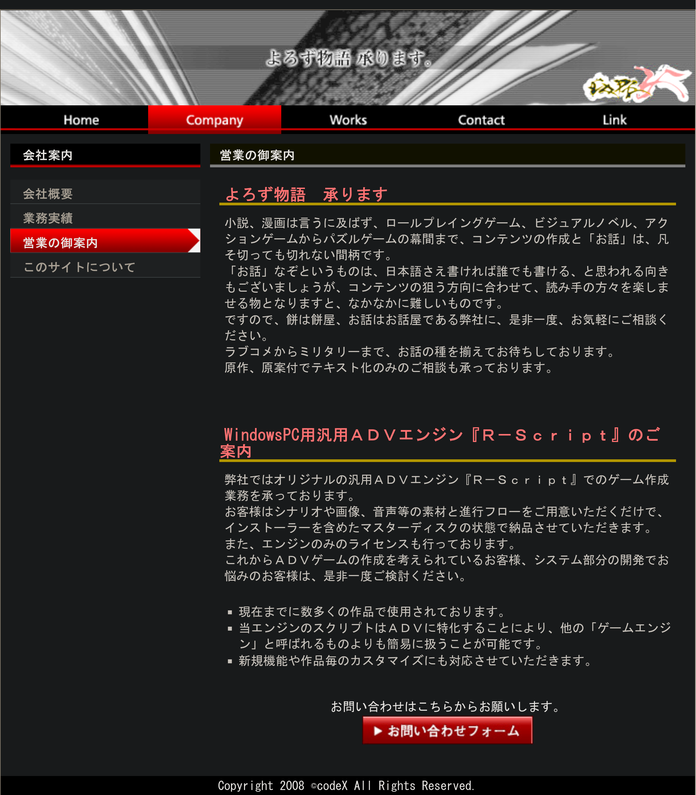

# LiarsoftTool &nbsp; [中文](#中文) | [English](#english)

http://www.codex.jp


A comprehensive toolkit for visual novels powered by the **Codex RScript** engine,
developed by circles including **CodeX**, **Liar-soft (骗子社)**, **rail-soft**, and
**スタジオ奪トランス (Studio Ubai Trans)**. Handles archive packing/unpacking,
image decoding/encoding, script extraction/injection, and audio extraction.

针对 **CodeX**, **Liar-soft（骗子社）**、**rail-soft**、**スタジオ奪トランス**
等社团使用 **Codex RScript** 引擎开发的视觉小说/文字游戏的综合资源处理工具。支持封包解包、图像编解码、脚本提取/注入、音频提取。

**References / 参考项目：**
- [RaiLTools](https://github.com/EusthEnoptEron/RaiLTools) — original C# reverse-engineering (GSC/XFL/LWG/WCG)
- [arc_unpacker](https://github.com/vn-tools/arc_unpacker) — C++ port of CG decompression (WCG/LIM)
- [GARbro](https://github.com/crskycode/GARbro) — WCG encoder reference implementation

---

## 中文

### 速查表

| 需求 | 命令 |
|------|------|
| 提取脚本原文 | `liarsofttool -e gbk scenario.gsc` |
| 翻译后注回 | `liarsofttool -e gbk -r original.gsc trans.txt` |
| 解包资源封包 | `liarsofttool -e shift_jis archive.xfl` |
| 解包场景封包 | `liarsofttool cgview.lwg` |
| WCG 转 PNG | `liarsofttool image.wcg` |
| LIM 转 PNG | `liarsofttool image.lim` |
| PNG 转 WCG | `liarsofttool image.png` |
| WAV 提取 OGG | `liarsofttool audio.wav` |
| OGG 嵌入 WAV | `liarsofttool -r template.wav audio.ogg` |
| 打包目录→XFL | `liarsofttool -e shift_jis ./dir` |
| 打包目录→LWG | `liarsofttool -e shift_jis ./dir_with_meta` |
| EXE 编码转换 | `liarsofttool -e gbk game.exe` |
| 批量转换 | `liarsofttool *.png` 或 `liarsofttool * -e gbk` |

> **提示**：日文版用 `shift_jis`，中文版用 `-e gbk`，西里尔/英文版用 `-e cp1251`。CP1251 也是引擎默认正确显示英语的编码。

### 编译

**依赖：** CMake ≥ 3.10, GCC ≥ 9（C++17 + `<filesystem>`）, libiconv

```bash
cd LiarsoftTool
mkdir build && cd build
cmake -DCMAKE_BUILD_TYPE=Release ..
make -j$(nproc)
# CLI 版本
sudo cp liarsofttool /usr/local/bin/
# GUI 版本（Linux 需 GTKmm 3，Windows 原生 Win32 无额外依赖）
# 直接运行 build/liarsofttool-gui 或双击 EXE
```

#### Windows 原生编译 (MSYS2)

```bash
# 在 MSYS2 UCRT64 终端中
pacman -S mingw-w64-ucrt-x86_64-{gcc,cmake,make}
cd LiarsoftTool
mkdir build && cd build
cmake -DCMAKE_BUILD_TYPE=Release -G "Unix Makefiles" ..
make -j$(nproc)
# 产出 liarsofttool.exe 和 liarsofttool-gui.exe
```

#### 从 Linux 交叉编译 Windows 版

```bash
sudo apt install g++-mingw-w64-x86-64
mkdir build/win && cd build/win
cmake -DCMAKE_BUILD_TYPE=Release \
      -DCMAKE_CXX_COMPILER=x86_64-w64-mingw32-g++ \
      -DCMAKE_SYSTEM_NAME=Windows ../..
make -j$(nproc)
# 产出 liarsofttool.exe 和 liarsofttool-gui.exe
```

### GUI 图形界面

直接运行 `liarsofttool-gui` 或双击可执行文件启动：

- **拖放文件**到窗口即可添加到转换列表
- 编码选择（Shift-JIS / GBK / CP1251）、参考 GSC 指定、输出目录
- 显示输入路径、输出路径、转换类型、状态四列
- 批量转换带进度条，后台多线程不阻塞界面
- Linux 使用 GTK3，Windows 使用原生 Win32 API（零额外 DLL 依赖）

### 命令行参数

| 参数 | 说明 |
|------|------|
| `-e, --encoding <enc>` | 编码：`shift_jis`（日文，默认）/ `gbk`（中文）/ `cp1251`（西里尔及英文） |
| `-r, --reference <path>` | TXT→GSC 时所需的参考 GSC 文件 |
| `-o, --output <path>` | 显式指定输出路径 |
| `-h, --help` | 显示帮助 |

支持多个输入文件及 shell 通配符：`liarsofttool *.wcg`、`liarsofttool * -e gbk`。
两个参数时若扩展名不同则视为 `输入 输出`（向后兼容）。

### 支持格式

| 格式 | 扩展名 | 操作 | 说明 |
|------|--------|------|------|
| XFL | `.xfl` | 解包/打包 | 通用资源封包，Magic: `LB\x01\x00` |
| LWG | `.lwg` | 解包/打包 | 场景合成封包，Magic: `LG\x01\x00`，含图层 X/Y/Flag |
| GSC | `.gsc` | 提取/注回 | 游戏脚本。兼容标准头（36B）及非标准头（28B，部分翻译工具产出），自动按 HeaderLength 适配 |
| WCG | `.wcg` | ↔ PNG | 32-bit BGRA，两次 CG 解压/压缩（有损） |
| LIM | `.lim` | → PNG | 32-bit 四通道 或 16-bit BGR565+Alpha |
| EXE | `.exe` | SJIS⇄GBK/CP1251 | 修改引擎编码参数 (`0x80`⇄`0x86`⇄`0xCC`)，`-e gbk/cp1251` 前向，`-e shift_jis` 还原 |
| WAV | `.wav` | → OGG | 偏移 66 处嵌入 Ogg Vorbis |
| OGG | `.ogg` | → WAV | 需 `-r` 指定模板 WAV（自动复用其 66 字节头） |

GSC 文本格式：`#` 标记原文，`>` 标记译文，支持 `\t`（全角空格）和多行。

### 典型工作流

```bash
# --- 汉化流程 ---
liarsofttool -e gbk data.xfl unpacked/
liarsofttool -e gbk unpacked/0010.gsc              # → 0010.txt
# 翻译 0010.txt …
liarsofttool -e gbk -r unpacked/0010.gsc 0010.txt  # → 0010.gsc
cp 0010.gsc unpacked/0010.gsc
liarsofttool -e gbk unpacked/                      # → unpacked.xfl

# --- 场景编辑 ---
liarsofttool cgview.lwg cgview/                    # 解包+生成 .meta.xml
liarsofttool cgview/bg.wcg                         # → bg.png
# 编辑 bg.png …
liarsofttool cgview/bg.png                         # → bg.wcg
liarsofttool cgview/                               # → cgview.lwg

# --- EXE 编码转换 ---
liarsofttool -e gbk game.exe        # SJIS→GBK
liarsofttool -e cp1251 game.exe     # SJIS→CP1251 (Russian)
liarsofttool -e shift_jis game.exe  # revert GBK/CP1251→SJIS
# 输出 name.gbk.exe / name.cp1251.exe / name.sjis.exe，不覆盖原文件

# --- 音频往返 ---
liarsofttool audio.wav                         # → audio.ogg
liarsofttool -r audio.wav audio.ogg            # → audio.wav（还原）
```

### 已知限制

- **多级目录**：XFL/LWG 中文件均扁平存放。

---

## English

### Quick Reference

| Task | Command |
|------|---------|
| Extract script strings | `liarsofttool -e gbk scenario.gsc` |
| Inject translation | `liarsofttool -e gbk -r original.gsc trans.txt` |
| Unpack resource archive | `liarsofttool -e shift_jis archive.xfl` |
| Unpack scene archive | `liarsofttool cgview.lwg` |
| WCG to PNG | `liarsofttool image.wcg` |
| LIM to PNG | `liarsofttool image.lim` |
| PNG to WCG | `liarsofttool image.png` |
| WAV extract OGG | `liarsofttool audio.wav` |
| OGG embed to WAV | `liarsofttool -r template.wav audio.ogg` |
| Pack directory → XFL | `liarsofttool -e shift_jis ./dir` |
| Pack directory → LWG | `liarsofttool -e shift_jis ./dir_with_meta` |
| EXE encoding convert | `liarsofttool -e gbk game.exe` |
| Batch convert | `liarsofttool *.png` or `liarsofttool * -e gbk` |

> **Tip:** Use `shift_jis` for Japanese, `-e gbk` for Chinese, `-e cp1251` for Cyrillic/English texts. CP1251 is also the engine's default for correct English rendering.
> Output paths default to the input file's directory when omitted.

### Build

**Requirements:** CMake ≥ 3.10, GCC ≥ 9 (C++17 + `<filesystem>`), libiconv

```bash
cd LiarsoftTool
mkdir build && cd build
cmake -DCMAKE_BUILD_TYPE=Release ..
make -j$(nproc)
# CLI version
sudo cp liarsofttool /usr/local/bin/
# GUI version (Linux: GTKmm 3 required; Windows: native Win32, no extra deps)
# Run build/liarsofttool-gui directly or double-click the EXE
```

#### Native Windows build (MSYS2)

```bash
# In MSYS2 UCRT64 terminal
pacman -S mingw-w64-ucrt-x86_64-{gcc,cmake,make}
cd LiarsoftTool
mkdir build && cd build
cmake -DCMAKE_BUILD_TYPE=Release -G "Unix Makefiles" ..
make -j$(nproc)
# Produces liarsofttool.exe and liarsofttool-gui.exe
```

#### Cross-compile Windows from Linux

```bash
sudo apt install g++-mingw-w64-x86-64
mkdir build/win && cd build/win
cmake -DCMAKE_BUILD_TYPE=Release \
      -DCMAKE_CXX_COMPILER=x86_64-w64-mingw32-g++ \
      -DCMAKE_SYSTEM_NAME=Windows ../..
make -j$(nproc)
# Produces liarsofttool.exe and liarsofttool-gui.exe
```

### GUI

Run `liarsofttool-gui` or double-click the executable:

- **Drag & drop** files onto the window to add them
- Encoding selector (Shift-JIS / GBK / CP1251), optional reference, output directory
- Four-column list: Input Path, Output Path, Type, Status
- Batch conversion with progress bar; background threading keeps UI responsive
- Linux: GTK3 backend. Windows: native Win32 API (zero extra DLL dependencies)

### CLI Options

| Option | Description |
|--------|-------------|
| `-e, --encoding <enc>` | Encoding: `shift_jis` (JP, default) / `gbk` (CN) / `cp1251` (Cyrillic & English) |
| `-r, --reference <path>` | Reference GSC or WAV for injection |
| `-o, --output <path>` | Explicit output path |
| `-h, --help` | Show help |

Multiple inputs and shell wildcards are supported: `liarsofttool *.wcg`, `liarsofttool * -e gbk`.
When exactly two args have different extensions, the second is treated as output (backward compat).

### Supported Formats

| Format | Extension | Operation | Notes |
|--------|-----------|-----------|-------|
| XFL | `.xfl` | unpack/pack | Resource archive, Magic: `LB\x01\x00` |
| LWG | `.lwg` | unpack/pack | Scene composition, Magic: `LG\x01\x00`, with layer X/Y/Flag |
| GSC | `.gsc` | extract/inject | Game script. Compatible with standard 36B header and non-standard 28B header (from some translation tools), auto-adapts to HeaderLength |
| WCG | `.wcg` | ↔ PNG | 32-bit BGRA, dual-pass CG compress/decompress (lossy) |
| LIM | `.lim` | → PNG | 32-bit 4-channel or 16-bit BGR565+Alpha |
| EXE | `.exe` | SJIS⇄GBK/CP1251 | Patches code-page byte (`0x80`⇄`0x86`⇄`0xCC`). `-e gbk/cp1251` forward, `-e shift_jis` reverse |
| WAV | `.wav` | → OGG | Embedded Ogg Vorbis at offset 66 |
| OGG | `.ogg` | → WAV | Needs `-r` template WAV (reuses its 66-byte header) |

GSC text format: `#` prefix for original, `>` for translation. Supports `\t` and multi-line.

### Typical Workflows

```bash
# --- Translation ---
liarsofttool -e gbk data.xfl unpacked/
liarsofttool -e gbk unpacked/0010.gsc              # → 0010.txt
# translate 0010.txt …
liarsofttool -e gbk -r unpacked/0010.gsc 0010.txt  # → 0010.gsc
cp 0010.gsc unpacked/0010.gsc
liarsofttool -e gbk unpacked/                      # → unpacked.xfl

# --- Scene editing ---
liarsofttool cgview.lwg cgview/                    # unpack + generate .meta.xml
liarsofttool cgview/bg.wcg                         # → bg.png
# edit bg.png …
liarsofttool cgview/bg.png                         # → bg.wcg
liarsofttool cgview/                               # → cgview.lwg

# --- EXE encoding conversion ---
liarsofttool -e gbk game.exe        # SJIS→GBK
liarsofttool -e cp1251 game.exe     # SJIS→CP1251 (Russian)
liarsofttool -e shift_jis game.exe  # revert GBK/CP1251→SJIS
# Output: name.gbk.exe / name.cp1251.exe / name.sjis.exe; original untouched

# --- Audio roundtrip ---
liarsofttool audio.wav                         # → audio.ogg
liarsofttool -r audio.wav audio.ogg            # → audio.wav (restored)
```

### Known Limitations

- **Subdirectories**: all files in XFL/LWG archives are flat (no nesting).

---

## License

GNU General Public License v3.0 (inherited from arc_unpacker's CG decompression code).

Third-party code:
- [stb_image](https://github.com/nothings/stb) (public domain) — PNG read/write
- CG decompression algorithm from [arc_unpacker](https://github.com/vn-tools/arc_unpacker) (GPLv3)

