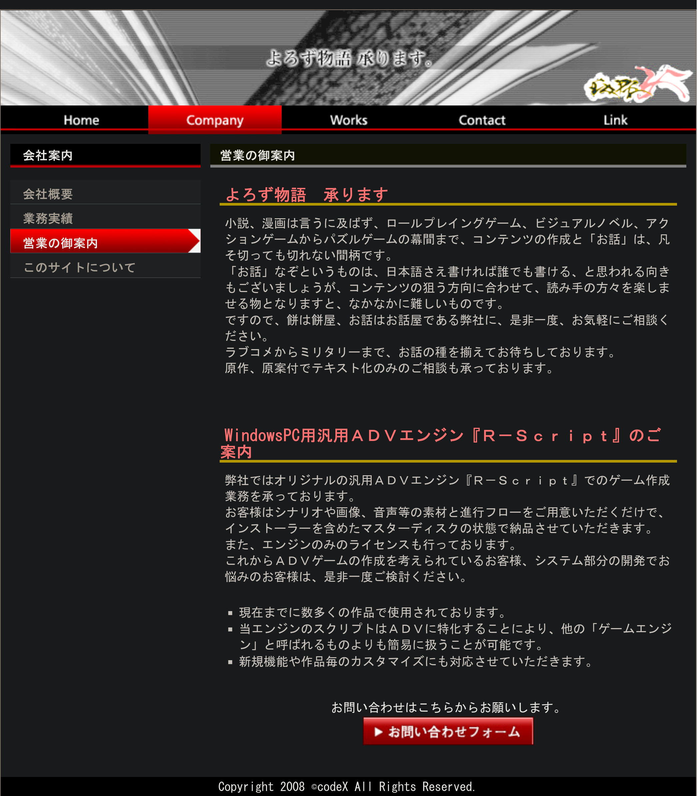

# LiarsoftTool &nbsp; [中文](#中文) | [English](#english)

http://www.codex.jp


A comprehensive toolkit for visual novels powered by the **Codex RScript** engine,
developed by circles including **CodeX**, **Liar-soft (骗子社)**, **rail-soft**, and
**スタジオ奪トランス (Studio Ubai Trans)**. Handles archive packing/unpacking,
image decoding/encoding, script extraction/injection, and audio extraction.

针对 **CodeX**, **Liar-soft（骗子社）**、**rail-soft**、**スタジオ奪トランス**
等社团使用 **Codex RScript** 引擎开发的视觉小说/文字游戏的综合资源处理工具。支持封包解包、图像编解码、脚本提取/注入、音频提取。

本项目负责从用户合法持有的游戏中解包并转换 XFL/LWG、GSC、WCG/LIM
和封装 WAV 等原始资源。若要把处理后的 CodeX RScript 游戏迁移到 Ren'Py，
请配合 [rscript2renpy](https://github.com/Love-in-idleness/rscript2renpy)；
`rscript2renpy` 的资源预处理流程依赖本工具。

**References / 参考项目：**
- [RaiLTools](https://github.com/EusthEnoptEron/RaiLTools) — original C# reverse-engineering (GSC/XFL/LWG/WCG)
- [arc_unpacker](https://github.com/vn-tools/arc_unpacker) — C++ port of CG decompression (WCG/LIM)
- [GARbro](https://github.com/crskycode/GARbro) — WCG encoder reference implementation

---

## 中文

### 速查表

| 需求 | 命令 |
|------|------|
| 提取脚本原文 | `liarsofttool -e gbk scenario.gsc` |
| 实验性 GSC 反编译 | `liarsofttool --gsc-to-tsc scenario.gsc` |
| 从 TSC 恢复/更新 GSC | `liarsofttool scenario.tsc` |
| 翻译后注回 | `liarsofttool -e gbk -r original.gsc trans.txt` |
| 解包资源封包 | `liarsofttool -e cp932 archive.xfl` |
| 解包场景封包 | `liarsofttool cgview.lwg` |
| WCG 转 PNG | `liarsofttool image.wcg` |
| LIM 转 PNG | `liarsofttool image.lim` |
| PNG 转 WCG | `liarsofttool image.png` |
| WAV 提取 OGG（标准 PCM 保留） | `liarsofttool audio.wav` |
| OGG 嵌入 WAV | `liarsofttool -r template.wav audio.ogg` |
| 打包目录→XFL | `liarsofttool -e cp932 ./dir` |
| 打包目录→LWG | `liarsofttool -e cp932 ./dir_with_meta` |
| 递归解包并转换 | `liarsofttool -R -e cp932 archive.xfl` |
| 转换并递归打包 | `liarsofttool -R -e cp932 ./dir` |
| 只执行封包方向 | `liarsofttool --pack-only <输入...>` |
| 只执行解包方向 | `liarsofttool --unpack-only <输入...>` |
| EXE 编码转换 | `liarsofttool -e gbk game.exe` |
| 批量转换 | `liarsofttool *.png` 或 `liarsofttool * -e gbk` |

> **提示**：日文版用 `cp932`（Windows-31J，默认；`shift_jis` 等旧别名也会映射到 CP932），中文版用 `-e gbk`，西里尔/英文版用 `-e cp1251`。CP1251 也是引擎默认正确显示英语的编码。

### 编译

**依赖：** CMake ≥ 3.10, GCC ≥ 9（C++17 + `<filesystem>`）, libiconv

```bash
cd LiarsoftTool
mkdir build && cd build
cmake -DCMAKE_BUILD_TYPE=Release ..
make -j$(nproc)
# CLI 版本
sudo cp liarsofttool /usr/local/bin/
# GUI 版本（Linux 需 GTKmm 3，Windows 原生 Win32 无额外依赖）
# 直接运行 build/liarsofttool-gui 或双击 EXE
```

#### Windows 原生编译 (MSYS2)

```bash
# 在 MSYS2 UCRT64 终端中
pacman -S mingw-w64-ucrt-x86_64-{gcc,cmake,make}
cd LiarsoftTool
mkdir build && cd build
cmake -DCMAKE_BUILD_TYPE=Release -G "Unix Makefiles" ..
make -j$(nproc)
# 产出 liarsofttool.exe 和 liarsofttool-gui.exe
```

#### 从 Linux 交叉编译 Windows 版

```bash
sudo apt install g++-mingw-w64-x86-64
mkdir build/win && cd build/win
cmake -DCMAKE_BUILD_TYPE=Release \
      -DCMAKE_CXX_COMPILER=x86_64-w64-mingw32-g++ \
      -DCMAKE_SYSTEM_NAME=Windows ../..
make -j$(nproc)
# 产出 liarsofttool.exe 和 liarsofttool-gui.exe
```

### GUI 图形界面

直接运行 `liarsofttool-gui` 或双击可执行文件启动：

- **拖放文件**到窗口即可添加到转换列表
- 编码选择（CP932 / GBK / CP1251）、参考 GSC 指定、输出目录，以及递归/仅封包/仅解包/实验性 GSC→TSC 开关
- 显示输入路径、输出路径、转换类型、状态四列
- 批量转换带进度条，后台多线程不阻塞界面
- Linux 使用 GTK3，Windows 使用原生 Win32 API（零额外 DLL 依赖）

### 命令行参数

| 参数 | 说明 |
|------|------|
| `-e, --encoding <enc>` | 编码：`cp932`（Windows-31J 日文，默认）/ `gbk`（中文）/ `cp1251`（西里尔及英文） |
| `-r, --reference <path>` | TXT→GSC 时所需的参考 GSC 文件 |
| `-o, --output <path>` | 显式指定输出路径 |
| `-R, --recursive` | 递归处理输入目录和子封包，并在打包/解包时自动转换资源 |
| `--pack-only` | 只执行封包及编码方向的输入 |
| `--unpack-only` | 只执行解包及解码方向的输入 |
| `--gsc-to-tsc` | 实验性：将 GSC 反编译为带源码偏移注释的 UTF-8 TSC，而非提取为 TXT |
| `-h, --help` | 显示帮助 |

支持多个输入文件及 shell 通配符：`liarsofttool *.wcg`、`liarsofttool * -e gbk`。
两个参数时若扩展名不同则视为 `输入 输出`（向后兼容）。
`-R --unpack-only <目录>` 会遍历目录树中的每个可解包文件，不会把目录重新封包。

### 支持格式

| 格式 | 扩展名 | 操作 | 说明 |
|------|--------|------|------|
| XFL | `.xfl` | 解包/打包 | 通用资源封包，Magic: `LB\x01\x00` |
| LWG | `.lwg` | 解包/打包 | 场景合成封包，Magic: `LG\x01\x00`，含图层 X/Y/Flag |
| GSC | `.gsc` | 提取/注回 | 游戏脚本。兼容现代头（36B）及早期头（28B），自动按 HeaderLength 适配 |
| TSC | `.tsc` | → GSC | 从结构化指令、字符串和数据块重新编译 GSC；支持直接修改正文 |
| WCG | `.wcg` | ↔ PNG | 32-bit BGRA，两次 CG 解压/压缩（有损） |
| LIM | `.lim` | → PNG | 32-bit 四通道 或 16-bit BGR565+Alpha |
| EXE | `.exe` | CP932⇄GBK/CP1251 | 修改引擎编码参数 (`0x80`⇄`0x86`⇄`0xCC`)，`-e gbk/cp1251` 前向，`-e cp932` 还原 |
| WAV | `.wav` | → OGG/保留 | 提取偏移 66 的嵌入 Ogg；标准 PCM WAV 无需转换 |
| OGG | `.ogg` | → WAV | 需 `-r` 指定模板 WAV（自动复用其 66 字节头） |

GSC 文本格式：`#` 标记原文，`>` 标记译文，支持 `\t`（全角空格）和多行。

`--gsc-to-tsc` 支持 28 字节早期（含 CodeX 之前）头，以及采用 RScript 1.8、1.9
或现代指令布局的 36 字节头；程序会根据完整指令边界、跳转目标和操作数结构
自动选择布局，并将选择写入 TSC 元数据。已识别文件的 TSC 正文由主动可编译的
`*命令`、`*vm`、标签、`*datablock` 和字符串字面量组成，不保存原代码区或原字符串表。
回编时会重新编码字符串，按内容去重，并重算字符串索引、偏移、代码、数据块及完整头部。
因此生成结果保证结构和执行语义一致，但调试表、字符串编号和字节排列不保证与原文件完全
相同。28 字节格式按旧引擎规则以 16 位字数计算 Section D 的声明长度；36 字节格式
会生成标准空调试表和名字表终止符。
只有无法识别指令布局的文件才使用 `;@gsc-raw-v1` 兼容回退，并明确标注无法反编译。
`*TXT`/`*TXA` 的字符串参数、`*font` 的文字、`*folder` 路径、选择题文字和字符串操作
都直接出现在正文中。普通注释不参与生成；可以修改、新增、删除和重排完整指令，但标签及
各指令参数仍须符合所记录的 RScript schema。旧版结构化 TSC 不再兼容，须从原 GSC 重生成。
与 `-R --unpack-only` 组合时，会在整个目录树及内嵌封包中生成 `.tsc`；递归
封包会先将这种 TSC 恢复或更新为 GSC。

完整映射及未知项见 [GSC opcode 与 TSC 命令对照表](docs/GSC_OPCODE_REFERENCE.md)。

### 典型工作流

```bash
# --- 汉化流程 ---
liarsofttool -e gbk data.xfl unpacked/
liarsofttool -e gbk unpacked/0010.gsc              # → 0010.txt
# 翻译 0010.txt …
liarsofttool -e gbk -r unpacked/0010.gsc 0010.txt  # → 0010.gsc
cp 0010.gsc unpacked/0010.gsc
liarsofttool -e gbk unpacked/                      # → unpacked.xfl

# --- 场景编辑 ---
liarsofttool cgview.lwg cgview/                    # 解包+生成 .meta.xml
liarsofttool cgview/bg.wcg                         # → bg.png
# 编辑 bg.png …
liarsofttool cgview/bg.png                         # → bg.wcg
liarsofttool cgview/                               # → cgview.lwg

# --- EXE 编码转换 ---
liarsofttool -e gbk game.exe        # SJIS→GBK
liarsofttool -e cp1251 game.exe     # SJIS→CP1251 (Russian)
liarsofttool -e cp932 game.exe  # revert GBK/CP1251→CP932
# 输出 name.gbk.exe / name.cp1251.exe / name.sjis.exe，不覆盖原文件

# --- 音频往返 ---
liarsofttool audio.wav                         # 嵌入式 → audio.ogg；标准 PCM 原样保留
liarsofttool -r audio.wav audio.ogg            # → audio.wav（还原）
```

> 提示：所有输出文件采用"内容相同则不重写"策略——若生成结果与磁盘上已有文件二进制完全一致，将跳过写入以保留原文件的修改时间，方便增量/批量转换时避免无关文件被标记为已修改。

目录打包只收集 `.lim`、`.wcg`、`.gsc`、`.wav`、`.xml`、`.lwg`、`.xfl`、`.msk`（扩展名不区分大小写），PNG 等工程文件不会直接进入封包。默认只处理指定目录或封包的当前层。

启用 `-R` 或 GUI 的“Recursive”后，打包会先自底向上处理子目录：含 `.meta.xml` 的目录生成同名 LWG，其余可打包目录生成同名 XFL；同时自动执行 TSC→GSC、TXT→GSC（需同名 GSC 作为参考）、PNG/JPG/JPEG/BMP→WCG、OGG→WAV（需同名 WAV 作为模板）。图像转换遇到同名 LIM 时，会先将它改名为 `.lim.old`；如果备份已存在，则警告并跳过该图像。缺少参考文件、转换失败或子目录无法打包时，会警告并继续，且失败项的旧目标不会被收入本次封包。最外层没有有效资源时仍会报错，不生成空封包。

递归解包会继续解开内嵌 XFL/LWG，并自动执行 GSC→TXT、WCG/LIM→PNG、嵌入式 WAV→OGG；已经是标准 PCM 的 WAV 会原样保留并视为成功。单个文件失败只会产生警告，不会中断其余处理。

“仅封包”包括目录→XFL/LWG、TSC/TXT→GSC、图片→WCG、OGG→WAV；“仅解包”包括 XFL/LWG→目录、GSC→TXT、WCG/LIM→PNG、WAV→OGG。两者都不启用时维持原有的全类型处理；两者同时启用时所有输入都跳过，不写入文件。EXE 编码转换不属于这两个方向，仅在两者都未启用时执行。

### 已知限制

- **多级目录**：XFL/LWG 中文件均扁平存放。

---

## English

### Quick Reference

| Task | Command |
|------|---------|
| Extract script strings | `liarsofttool -e gbk scenario.gsc` |
| Experimental GSC decompile | `liarsofttool --gsc-to-tsc scenario.gsc` |
| Restore/update GSC from TSC | `liarsofttool scenario.tsc` |
| Inject translation | `liarsofttool -e gbk -r original.gsc trans.txt` |
| Unpack resource archive | `liarsofttool -e cp932 archive.xfl` |
| Unpack scene archive | `liarsofttool cgview.lwg` |
| WCG to PNG | `liarsofttool image.wcg` |
| LIM to PNG | `liarsofttool image.lim` |
| PNG to WCG | `liarsofttool image.png` |
| WAV extract OGG (retain PCM) | `liarsofttool audio.wav` |
| OGG embed to WAV | `liarsofttool -r template.wav audio.ogg` |
| Pack directory → XFL | `liarsofttool -e cp932 ./dir` |
| Pack directory → LWG | `liarsofttool -e cp932 ./dir_with_meta` |
| Recursively unpack and convert | `liarsofttool -R -e cp932 archive.xfl` |
| Convert and recursively pack | `liarsofttool -R -e cp932 ./dir` |
| Only pack/encode | `liarsofttool --pack-only <inputs...>` |
| Only unpack/decode | `liarsofttool --unpack-only <inputs...>` |
| EXE encoding convert | `liarsofttool -e gbk game.exe` |
| Batch convert | `liarsofttool *.png` or `liarsofttool * -e gbk` |

> **Tip:** Use `cp932` for Japanese (Windows-31J, default; legacy `shift_jis` aliases also map to CP932), `-e gbk` for Chinese, and `-e cp1251` for Cyrillic/English texts. CP1251 is also the engine's default for correct English rendering.
> Output paths default to the input file's directory when omitted.

### Build

**Requirements:** CMake ≥ 3.10, GCC ≥ 9 (C++17 + `<filesystem>`), libiconv

```bash
cd LiarsoftTool
mkdir build && cd build
cmake -DCMAKE_BUILD_TYPE=Release ..
make -j$(nproc)
# CLI version
sudo cp liarsofttool /usr/local/bin/
# GUI version (Linux: GTKmm 3 required; Windows: native Win32, no extra deps)
# Run build/liarsofttool-gui directly or double-click the EXE
```

#### Native Windows build (MSYS2)

```bash
# In MSYS2 UCRT64 terminal
pacman -S mingw-w64-ucrt-x86_64-{gcc,cmake,make}
cd LiarsoftTool
mkdir build && cd build
cmake -DCMAKE_BUILD_TYPE=Release -G "Unix Makefiles" ..
make -j$(nproc)
# Produces liarsofttool.exe and liarsofttool-gui.exe
```

#### Cross-compile Windows from Linux

```bash
sudo apt install g++-mingw-w64-x86-64
mkdir build/win && cd build/win
cmake -DCMAKE_BUILD_TYPE=Release \
      -DCMAKE_CXX_COMPILER=x86_64-w64-mingw32-g++ \
      -DCMAKE_SYSTEM_NAME=Windows ../..
make -j$(nproc)
# Produces liarsofttool.exe and liarsofttool-gui.exe
```

### GUI

Run `liarsofttool-gui` or double-click the executable:

- **Drag & drop** files onto the window to add them
- Encoding selector (CP932 / GBK / CP1251), optional reference, output directory, and recursive/pack-only/unpack-only/experimental GSC→TSC toggles
- Four-column list: Input Path, Output Path, Type, Status
- Batch conversion with progress bar; background threading keeps UI responsive
- Linux: GTK3 backend. Windows: native Win32 API (zero extra DLL dependencies)

### CLI Options

| Option | Description |
|--------|-------------|
| `-e, --encoding <enc>` | Encoding: `cp932` (Windows-31J JP, default) / `gbk` (CN) / `cp1251` (Cyrillic & English) |
| `-r, --reference <path>` | Reference GSC or WAV for injection |
| `-o, --output <path>` | Explicit output path |
| `-R, --recursive` | Process nested archives and convert resources while packing/unpacking |
| `--pack-only` | Only process packing and encoding inputs |
| `--unpack-only` | Only process unpacking and decoding inputs |
| `--gsc-to-tsc` | Experimental: decompile GSC to annotated UTF-8 TSC instead of extracting TXT |
| `-h, --help` | Show help |

Multiple inputs and shell wildcards are supported: `liarsofttool *.wcg`, `liarsofttool * -e gbk`.
When exactly two args have different extensions, the second is treated as output (backward compat).

### Supported Formats

| Format | Extension | Operation | Notes |
|--------|-----------|-----------|-------|
| XFL | `.xfl` | unpack/pack | Resource archive, Magic: `LB\x01\x00` |
| LWG | `.lwg` | unpack/pack | Scene composition, Magic: `LG\x01\x00`, with layer X/Y/Flag |
| GSC | `.gsc` | extract/inject | Game script. Compatible with modern 36B and early 28B headers; auto-adapts to HeaderLength |
| TSC | `.tsc` | → GSC | Recompile GSC from structured instructions, strings, and data blocks; body is directly editable |
| WCG | `.wcg` | ↔ PNG | 32-bit BGRA, dual-pass CG compress/decompress (lossy) |
| LIM | `.lim` | → PNG | 32-bit 4-channel or 16-bit BGR565+Alpha |
| EXE | `.exe` | CP932⇄GBK/CP1251 | Patches code-page byte (`0x80`⇄`0x86`⇄`0xCC`). `-e gbk/cp1251` forward, `-e cp932` reverse |
| WAV | `.wav` | → OGG/retain | Extract Ogg embedded at offset 66; standard PCM WAV needs no conversion |
| OGG | `.ogg` | → WAV | Needs `-r` template WAV (reuses its 66-byte header) |

GSC text format: `#` prefix for original, `>` for translation. Supports `\t` and multi-line.

`--gsc-to-tsc` supports early 28-byte headers (including pre-CodeX variants)
and 36-byte headers using
RScript 1.8, RScript 1.9, or modern instruction layouts. It selects a layout
from complete instruction boundaries, jump targets, and operand structure, then
records that choice in TSC metadata.
For recognized layouts, the TSC body contains active `*command`, `*vm`, label,
`*datablock`, and quoted-string source instead of embedded code or string-table
bytes. Recompilation re-encodes and interns strings, recalculates every index and
offset, rebuilds code and data blocks, and writes the complete 28- or 36-byte
container. The result is structurally and semantically equivalent; debug tables,
string numbering, and byte layout need not be identical to the input. Legacy
containers count Section D in 16-bit words when calculating the declared size;
modern containers receive the standard empty debug tables and names terminator. Files with unknown
instruction layouts retain the `;@gsc-raw-v1` fallback and are explicitly marked
unavailable for decompilation. Older structured TSC files are unsupported and
must be regenerated from their original GSC files. TXT/TXA, font, folder,
selection, and string-operation text appears directly in the source;
editing it rebuilds the string table as well.
Ordinary comments are ignored. Commands may be inserted, deleted, or reordered
as long as labels and operands remain valid for the recorded RScript schema.
Combined with `-R --unpack-only`, it generates `.tsc` throughout directory
trees and nested archives; recursive packing restores or updates them to GSC.

See the [GSC opcode/TSC command reference](docs/GSC_OPCODE_REFERENCE.md) for
the complete mapping and explicitly unknown entries.

### Typical Workflows

```bash
# --- Translation ---
liarsofttool -e gbk data.xfl unpacked/
liarsofttool -e gbk unpacked/0010.gsc              # → 0010.txt
# translate 0010.txt …
liarsofttool -e gbk -r unpacked/0010.gsc 0010.txt  # → 0010.gsc
cp 0010.gsc unpacked/0010.gsc
liarsofttool -e gbk unpacked/                      # → unpacked.xfl

# --- Scene editing ---
liarsofttool cgview.lwg cgview/                    # unpack + generate .meta.xml
liarsofttool cgview/bg.wcg                         # → bg.png
# edit bg.png …
liarsofttool cgview/bg.png                         # → bg.wcg
liarsofttool cgview/                               # → cgview.lwg

# --- EXE encoding conversion ---
liarsofttool -e gbk game.exe        # SJIS→GBK
liarsofttool -e cp1251 game.exe     # SJIS→CP1251 (Russian)
liarsofttool -e cp932 game.exe  # revert GBK/CP1251→CP932
# Output: name.gbk.exe / name.cp1251.exe / name.sjis.exe; original untouched

# --- Audio roundtrip ---
liarsofttool audio.wav                         # embedded → audio.ogg; standard PCM retained
liarsofttool -r audio.wav audio.ogg            # → audio.wav (restored)
```

> Tip: all outputs use a "skip if identical" policy — when the generated
> result is byte-identical to the file already on disk, the write is skipped
> so the existing file's modification time is preserved. This keeps
> incremental/batch conversions from touching unchanged files.

Directory packing only includes `.lim`, `.wcg`, `.gsc`, `.wav`, `.xml`, `.lwg`, `.xfl`, and `.msk` files (case-insensitive); project files such as PNG are never stored directly. By default, only the current level of the selected directory or archive is processed.

With `-R` or the GUI **Recursive** toggle, packing processes subdirectories deepest-first: directories containing `.meta.xml` become sibling LWG files, while other packable directories become sibling XFL files. It also performs TSC→GSC, TXT→GSC (requiring a same-name GSC reference), PNG/JPG/JPEG/BMP→WCG, and OGG→WAV (requiring a same-name WAV template). Before converting an image, a same-name LIM is renamed to `.lim.old`; if that backup already exists, the image is skipped with a warning. A missing reference, failed conversion, or failed child archive produces a warning and processing continues. Any stale target for that failed item is excluded from the new parent archive. The outermost archive still fails instead of creating an empty archive.

Recursive unpacking opens nested XFL/LWG archives and performs GSC→TXT, WCG/LIM→PNG, and embedded WAV→OGG. Standard PCM WAV files are retained unchanged and count as successful. Failure of one file produces a warning without stopping the remaining work.

**Pack only** covers directory→XFL/LWG, TSC/TXT→GSC, images→WCG, and OGG→WAV. **Unpack only** covers XFL/LWG→directory, GSC→TXT, WCG/LIM→PNG, and WAV→OGG. With neither enabled, all existing operations remain available. With both enabled, every input is skipped and no file is written. EXE encoding conversion belongs to neither direction and therefore runs only when both filters are off.

### Known Limitations

- **Subdirectories**: all files in XFL/LWG archives are flat (no nesting).

---

## License

GNU General Public License v3.0 (inherited from arc_unpacker's CG decompression code).

Third-party code:
- [stb_image](https://github.com/nothings/stb) (public domain) — PNG read/write
- CG decompression algorithm from [arc_unpacker](https://github.com/vn-tools/arc_unpacker) (GPLv3)
