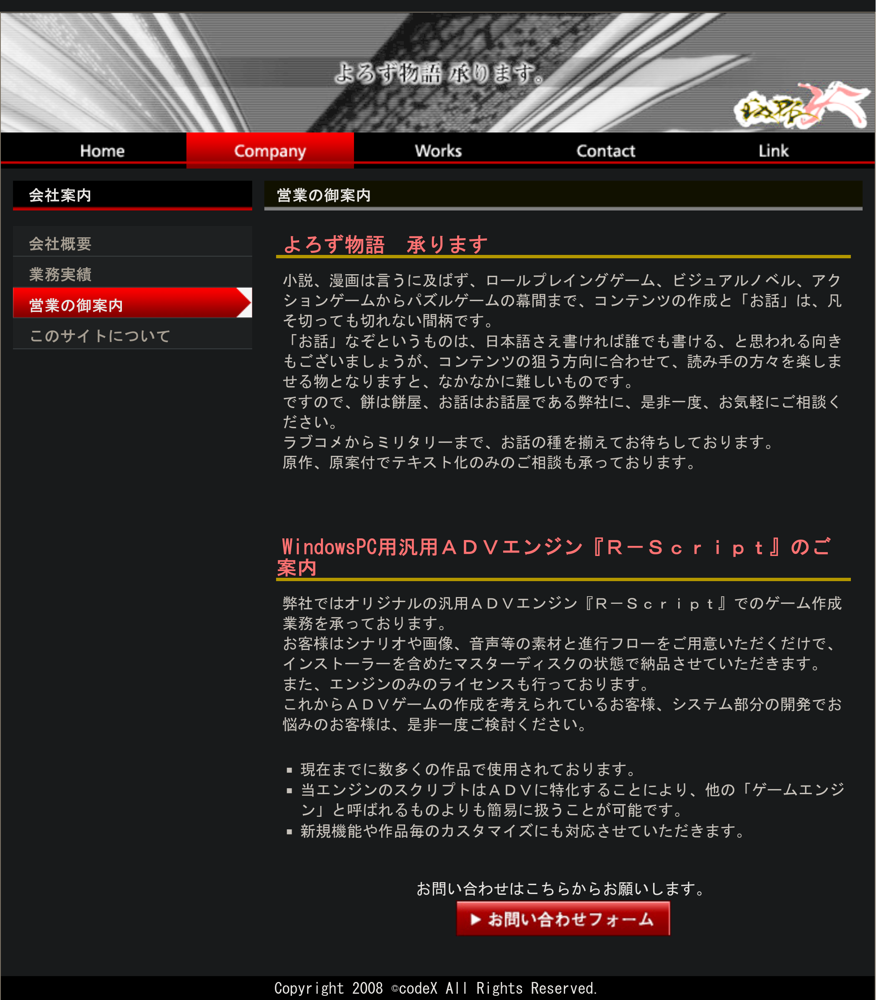

# LiarsoftTool &nbsp; [中文](#中文) | [English](#english)

http://www.codex.jp


A comprehensive toolkit for visual novels powered by the **Codex RScript** engine,
developed by circles including **CodeX**, **Liar-soft (骗子社)**, **rail-soft**, and
**スタジオ奪トランス (Studio Ubai Trans)**. Handles archive packing/unpacking,
image decoding/encoding, script extraction/injection, and audio extraction.

针对 **CodeX**, **Liar-soft（骗子社）**、**rail-soft**、**スタジオ奪トランス**
等社团使用 **Codex RScript** 引擎开发的视觉小说/文字游戏的综合资源处理工具。支持封包解包、图像编解码、脚本提取/注入、音频提取。

本项目负责从用户合法持有的游戏中解包并转换 XFL/LWG、GSC、WCG/LIM
和封装 WAV 等原始资源。若要把处理后的 CodeX RScript 游戏迁移到 Ren'Py，
请配合 [rscript2renpy](https://github.com/Love-in-idleness/rscript2renpy)；
`rscript2renpy` 的资源预处理流程依赖本工具。

**References / 参考项目：**
- [RaiLTools](https://github.com/EusthEnoptEron/RaiLTools) — original C# reverse-engineering (GSC/XFL/LWG/WCG)
- [arc_unpacker](https://github.com/vn-tools/arc_unpacker) — C++ port of CG decompression (WCG/LIM)
- [GARbro](https://github.com/crskycode/GARbro) — WCG encoder reference implementation

---

## 中文

### 速查表

| 需求 | 命令 |
|------|------|
| 提取脚本原文 | `liarsofttool -e gbk scenario.gsc` |
| GSC 转结构化 TSC | `liarsofttool --gsc-to-tsc scenario.gsc` |
| 从 TSC 恢复/更新 GSC | `liarsofttool scenario.tsc` |
| 翻译后注回 | `liarsofttool -e gbk -r original.gsc trans.txt` |
| 解包资源封包 | `liarsofttool -e cp932 archive.xfl` |
| 解包场景封包 | `liarsofttool cgview.lwg` |
| WCG 转 PNG | `liarsofttool image.wcg` |
| LIM 转无损 WebP | `liarsofttool image.lim` |
| WebP 转 LIM | `liarsofttool image.webp` |
| PNG 转 WCG | `liarsofttool image.png` |
| WAV 提取 OGG（标准 PCM 保留） | `liarsofttool audio.wav` |
| OGG 解码为 PCM WAV（默认） | `liarsofttool audio.ogg` |
| OGG 保留压缩流、封装为 WAV | `liarsofttool --vorbis-in-wav audio.ogg` |
| 打包目录→XFL | `liarsofttool -e cp932 ./dir` |
| 打包目录→LWG | `liarsofttool -e cp932 ./dir_with_meta` |
| 递归解包并转换 | `liarsofttool -R -e cp932 archive.xfl` |
| 转换并递归打包 | `liarsofttool -R -e cp932 ./dir` |
| 只执行封包方向 | `liarsofttool --pack-only <输入...>` |
| 只执行解包方向 | `liarsofttool --unpack-only <输入...>` |
| EXE 编码转换 | `liarsofttool -e gbk game.exe` |
| 批量转换 | `liarsofttool *.png` 或 `liarsofttool * -e gbk` |

> **提示**：日文版用 `cp932`（Windows-31J，默认；`shift_jis` 等旧别名也会映射到 CP932），中文版用 `-e gbk`，西里尔/英文版用 `-e cp1251`。EXE 转换会同步已识别的 RScript 禁则标点表（经典立即数比较及 Evermaiden 的寄存器比较结构）；运行时仍需使用与文本匹配的 Windows 系统代码页或 Locale Emulator（CP932/936/1251）。

### 编译

**依赖：** CMake ≥ 3.10, GCC ≥ 9（C++17 + `<filesystem>`）, libiconv、libwebp、libvorbis/libogg 开发库（Debian/Ubuntu：`libwebp-dev libvorbis-dev libogg-dev`）

```bash
cd LiarsoftTool
mkdir build && cd build
cmake -DCMAKE_BUILD_TYPE=Release ..
make -j$(nproc)
# CLI 版本
sudo cp liarsofttool /usr/local/bin/
# GUI 版本（Linux 需 GTKmm 3，Windows 使用原生 Win32，无需 GTK）
# 直接运行 build/liarsofttool-gui 或双击 EXE
```

#### Windows 原生编译 (MSYS2)

```bash
# 在 MSYS2 UCRT64 终端中
pacman -S mingw-w64-ucrt-x86_64-{gcc,cmake,make,libwebp,libvorbis,libogg}
cd LiarsoftTool
mkdir build && cd build
cmake -DCMAKE_BUILD_TYPE=Release -G "Unix Makefiles" ..
make -j$(nproc)
# 产出 liarsofttool.exe 和 liarsofttool-gui.exe
```

#### 从 Linux 交叉编译 Windows 版

需先为 MinGW 准备 Windows 目标的 libwebp 头文件和库，并通过 CMake 的
`WEBP_INCLUDE_DIR` / `WEBP_LIBRARY` 指定；不能链接本机 Linux 的 libwebp。
新版静态 libwebp 还需同一目标平台的 libsharpyuv，可通过 `WEBP_SHARPYUV_LIBRARY` 指定。
音频还需目标平台的 libogg/libvorbis/libvorbisfile；使用 `CMAKE_PREFIX_PATH` 指向其安装目录，
或指定 `OGG_INCLUDE_DIR`、`VORBIS_INCLUDE_DIR`、`OGG_LIBRARY`、`VORBIS_LIBRARY`、`VORBISFILE_LIBRARY`。
启用测试时还需 `VORBISENC_LIBRARY`（仅用于生成测试音频）。动态构建需附带相应 DLL。
若链接动态库，运行时须随程序提供对应的 WebP DLL；静态链接则无需该 DLL。

```bash
sudo apt install g++-mingw-w64-x86-64
mkdir build/win && cd build/win
cmake -DCMAKE_BUILD_TYPE=Release \
      -DCMAKE_CXX_COMPILER=x86_64-w64-mingw32-g++ \
      -DCMAKE_SYSTEM_NAME=Windows ../..
make -j$(nproc)
# 产出 liarsofttool.exe 和 liarsofttool-gui.exe
```

### GUI 图形界面

直接运行 `liarsofttool-gui` 或双击可执行文件启动：

- **拖放文件**到窗口即可添加到转换列表
- 编码选择（CP932 / GBK / CP1251）、参考 GSC 指定、输出目录，以及递归/仅封包/仅解包/GSC→TXT/Vorbis-in-WAV 开关；GSC 默认转换为结构化 TSC，OGG 默认解码为 PCM WAV，勾选 Vorbis-in-WAV 改为压缩封装
- 显示输入路径、输出路径、转换类型、状态四列
- 批量转换带进度条，后台多线程不阻塞界面
- 警告与错误提示提供“Copy details”一键复制，包含完整诊断信息及输入/输出路径，方便反馈问题
- Linux 使用 GTK3，Windows 使用原生 Win32 API；libwebp 动态构建需附带对应 DLL

### 命令行参数

| 参数 | 说明 |
|------|------|
| `-e, --encoding <enc>` | 编码：`cp932`（Windows-31J 日文，默认）/ `gbk`（中文）/ `cp1251`（西里尔及英文） |
| `-r, --reference <path>` | TXT→GSC 时所需的参考 GSC 文件 |
| `-o, --output <path>` | 显式指定输出路径 |
| `-R, --recursive` | 递归处理输入目录和子封包，并在打包/解包时自动转换资源 |
| `-j, --jobs <0..64>` | 递归资源转换的线程数；0 为自动（最多 4 个），1 为串行 |
| `--pack-only` | 只执行封包及编码方向的输入 |
| `--unpack-only` | 只执行解包及解码方向的输入 |
| `--gsc-to-tsc` | 将 GSC 反编译为结构化 UTF-8 TSC，而非提取为 TXT |
| `--vorbis-in-wav` | OGG→WAV 改为保留压缩流的 Vorbis-in-WAV 封装，含递归封包；不勾选默认解码为 PCM |
| `-h, --help` | 显示帮助 |

支持多个输入文件及 shell 通配符：`liarsofttool *.wcg`、`liarsofttool * -e gbk`。
两个参数时若扩展名不同则视为 `输入 输出`（向后兼容）。
`-R --unpack-only <目录>` 会遍历目录树中的每个可解包文件，不会把目录重新封包。

### 支持格式

| 格式 | 扩展名 | 操作 | 说明 |
|------|--------|------|------|
| XFL | `.xfl` | 解包/打包 | 通用资源封包，Magic: `LB\x01\x00` |
| LWG | `.lwg` | 解包/打包 | 场景合成封包，Magic: `LG\x01\x00`，含图层 X/Y/Flag |
| GSC | `.gsc` | 提取/注回 | 游戏脚本。兼容现代头（36B）及早期头（28B），自动按 HeaderLength 适配 |
| TSC | `.tsc` | → GSC | 从结构化指令、字符串和数据块重新编译 GSC；支持直接修改正文 |
| WCG | `.wcg` | ↔ PNG | 8 位 RGBA 像素无损转换，支持配对通道、独立四通道及透明度遮罩 |
| LIM | `.lim` | ↔ WebP | 无损 RGBA；读取 16-bit BGR565/遮罩，回写为版本 3 的独立 A/R/G/B 通道 |
| EXE | `.exe` | CP932/GBK/CP1251 | 修改引擎字体 charset 参数，并转换已识别的日文、中文或俄文禁则标点表 |
| WAV | `.wav` | → OGG/保留 | 按 RIFF 块定位嵌入 Ogg，不限制偏移 66；标准 PCM WAV 无需转换 |
| OGG | `.ogg` | → WAV | 默认解码为 16 位 PCM；可选 Vorbis-in-WAV；两种方式均不需要原 WAV |

WCG 编码默认使用两个 16 位颜色对；任一颜色对达到 65536 种时，自动改用独立 A/R/G/B 通道，避免调色板计数溢出并保持像素无损。仅透明度的 WCG 导出为 RGB 全零、透明度保留的 PNG，不补造颜色。四通道路径已根据 Cannonball 原程序验证静态逻辑，其他引擎的游戏内兼容性仍需测试；PNG 的 ICC/gamma 等元数据不会写入 WCG。

LIM 导出为无损 `.webp`，包括完全透明像素下的 RGB；同名 WCG 仍导出 `.png`，两者不互相覆盖。WebP 回写为版本 3 的 LIM，保持解码后的 RGBA 像素，但不保证原 LIM 的位深、压缩方式或字节排列不变。不支持动画 WebP；WebP 单边尺寸上限为 16383 像素。WebP 的 ICC/EXIF 等元数据不会写入 LIM。旧的 LIM 导出 PNG 请从原 LIM 重新生成 WebP，不能直接改后缀。

LWG 的零数据条目仍会写入 `.meta.xml`，以 `empty="1"` 保留名字、坐标、Flag 和顺序；回编不会误用同名图片填充它们。旧版解包已经丢失的条目需从原 LWG 重新提取。仅有空条目、没有有效资源的封包仍会报错。
图层名中的 XML 特殊字符会转义，回编时还原原名；实际文件名沿用解包时的文件系统字符替换规则。旧工具生成的非法 XML（例如包含 `</Layer set>` 原文）请从原 LWG 重新提取。

GSC 文本格式：`#` 标记原文，`>` 标记译文，支持 `\t`（全角空格）和多行。

`--gsc-to-tsc` 支持 28 字节早期（含 CodeX 之前）头，以及采用 RScript 1.8、1.9
或现代指令布局的 36 字节头；程序会根据完整指令边界、跳转目标和操作数结构
自动选择布局，并将选择写入 TSC 元数据。已识别文件的 TSC 正文由主动可编译的
`*命令`、`*vm`、标签、`*datablock` 和字符串字面量组成，不保存原代码区或原字符串表。
回编时会重新编码字符串，按内容去重，并重算字符串索引、偏移、代码、数据块及完整头部。
因此生成结果保证结构和执行语义一致，但调试表、字符串编号和字节排列不保证与原文件完全
相同。28 字节格式按旧引擎规则以 16 位字数计算 Section D 的声明长度；36 字节格式在默认
情况下生成标准空调试表和名字表终止符。
原文件若带有非空的调试/名字表（如 `scmode`、`REP001`），反编译会写出
`;@gsc-trailer <hex>`（Section D 之后的全部尾部字节）以及
`;@gsc-trailer-header <u7> <u8>`（头部第 7、8 个字，用于确定尾部两张表的长度，仅在非
标准值 4/1 时出现），回编时原样写回；没有这两行时按标准空调试表处理。28 字节格式没有
尾部区域，出现该元数据会直接报错。
28 字节头的字符串区长度偏小时，仅在字符串连续排列、原数据区校验失败、按真实 `00`
结束符补足后数据表有效且尾部仅有零填充时尝试恢复；指令及引用仍须通过校验。
成功恢复会通过 CLI/GUI/递归解包报告警告，并在 TSC 留下普通 `; warning:` 注释；
回编将重新计算正确长度，不保留过时头部及多余零填充。无法可靠恢复或识别指令布局的
文件使用 `;@gsc-raw-v1` 兼容回退，并明确标注无法反编译。
TSC 正文始终是 UTF-8，且**不再记录**字符串编码：`--gsc-to-tsc` 的 `-e` 决定按何种编码
解读原 GSC，`tsc → gsc` 的 `-e` 决定写出何种编码的 GSC。因此把日文 TSC 翻译成中文后，
回编时用 `-e gbk` 即可得到中文版引擎需要的 GBK 文件；忘记指定编码时（默认 CP932），
无法表示的文字会**直接报错**，而不是悄悄写成 `?`。旧 TSC 里遗留的 `;@gsc-text-encoding`
行会被忽略（编码始终以 `-e` 为准）。
`*TXT`/`*TXA` 的字符串参数、`*font` 的文字、`*folder` 路径、`*gosub` 的子程序名、
选择题文字和字符串操作都直接出现在正文中。普通注释不参与生成；可以修改、新增、删除和重排完整指令，但标签及
各指令参数仍须符合所记录的 RScript schema。旧版结构化 TSC 不再兼容，须从原 GSC 重生成。
与 `-R --unpack-only` 组合时，会在整个目录树及内嵌封包中生成 `.tsc`；递归
封包会先将这种 TSC 恢复或更新为 GSC。

完整映射及未知项见 [GSC opcode 与 TSC 命令对照表](docs/GSC_OPCODE_REFERENCE.md) / [English](docs/GSC_OPCODE_REFERENCE.en.md)。

### 典型工作流

```bash
# --- 汉化流程 ---
liarsofttool -e gbk data.xfl unpacked/
liarsofttool -e gbk unpacked/0010.gsc              # → 0010.txt
# 翻译 0010.txt …
liarsofttool -e gbk -r unpacked/0010.gsc 0010.txt  # → 0010.gsc
cp 0010.gsc unpacked/0010.gsc
liarsofttool -e gbk unpacked/                      # → unpacked.xfl

# --- 场景编辑 ---
liarsofttool cgview.lwg cgview/                    # 解包+生成 .meta.xml
liarsofttool cgview/bg.wcg                         # → bg.png
# 编辑 bg.png …
liarsofttool cgview/bg.png                         # → bg.wcg
liarsofttool cgview/                               # → cgview.lwg

# --- EXE 编码转换 ---
liarsofttool -e gbk game.exe        # 转换 GBK 字体及中文禁则表
liarsofttool -e cp1251 game.exe     # 转换 CP1251 字体及俄文禁则表
liarsofttool -e cp932 game.exe      # 恢复 CP932 字体及日文禁则表
# 输出 name.gbk.exe / name.cp1251.exe / name.sjis.exe，不覆盖原文件

# --- 音频往返 ---
liarsofttool audio.wav                         # 嵌入式 → audio.ogg；标准 PCM 原样保留
liarsofttool audio.ogg                         # → audio.wav（16 位 PCM）
liarsofttool --vorbis-in-wav audio.ogg          # → audio.wav（保留 Vorbis 压缩流）
```

OGG→WAV 默认完整解码为有符号 16 位小端 PCM，保留单/双声道和采样率，不重采样、不再次有损压缩；文件通常明显增大。为避免错误声道映射，暂不支持多于两声道的 PCM 输出，会明确报错。PCM WAV 不再含可直接提取的 OGG，也不能无损恢复原 OGG 压缩字节。

GUI 勾选 **Vorbis-in-WAV** 或 CLI 添加 `--vorbis-in-wav`，改为保留完整 Vorbis 流，自动构造 mode 1（`0x674f`）头、`fact` 和 RIFF/data 长度。不冒用可能依赖驱动内置码本的 mode 3 标记；读取仍支持含完整 Ogg 的 mode 1/1+/3/3+，不支持将 mode 2 的独立头直接当作完整 Ogg。RIFF 读取按块 ID、长度和偶数字节对齐定位，允许额外元数据、不同块顺序及不同长度的 `fmt`。

两种方式都不读取或依赖原 WAV，`-r` 仅用于 TXT→GSC。输入须为完整、连续的单流 Ogg Vorbis；损坏或不支持的输入报错且不覆盖已有目标。递归封包时警告、继续处理其他文件，并排除该失败项的旧目标。原游戏实际播放仍由用户验收，不承诺原 WAV 容器逐字节还原。旧实验性开关已移除。

> 提示：输出内容相同则不重写。解包/解码产生的文件会同步为直接来源文件的修改时间，即使内容相同也会同步时间；封包/编码方向仍保留内容相同的已有输出时间。

XFL/LWG 不保存条目的原始修改时间，解出的所有文件（含 `.meta.xml`）继承输入封包的修改时间；递归时向下传递到内层封包及 PNG、WebP、OGG、TXT/TSC。单独执行 GSC/WCG/LIM/WAV 解码也继承输入时间。不更改源文件、目录时间或输出目录内与本次解包无关的文件；标准 PCM WAV 不产生新 OGG，不改动已有同名 OGG。时间无法读取或设置时报告错误（递归时作为警告），不静默忽略。

目录打包只收集 `.lim`、`.wcg`、`.gsc`、`.wav`、`.xml`、`.lwg`、`.xfl`、`.msk`（扩展名不区分大小写），PNG 等工程文件不会直接进入封包。默认只处理指定目录或封包的当前层。

启用 `-R` 或 GUI 的“Recursive”后，打包会先自底向上处理子目录：含 `.meta.xml` 的目录生成同名 LWG，其余可打包目录生成同名 XFL；同时自动执行 TSC→GSC、TXT→GSC（需同名 GSC 作为参考）、PNG/JPG/JPEG/BMP→WCG、WebP→LIM、OGG→WAV（默认 PCM，可选 Vorbis-in-WAV，无需模板）。PNG 与 WebP 可同名共存，不再改名或生成 `.lim.old`。缺少参考文件、转换失败或子目录无法打包时，会警告并继续，且失败项的旧目标不会被收入本次封包。最外层没有有效资源时仍会报错，不生成空封包。

递归解包会继续解开内嵌 XFL/LWG，并自动处理 GSC（命令行默认生成 TXT，GUI 默认生成 TSC、勾选“GSC→TXT”后生成 TXT）、WCG→PNG、LIM→WebP、嵌入式 WAV→OGG；已经是标准 PCM 的 WAV 会原样保留并视为成功。单个文件失败只会产生警告，不会中断其余处理。

递归处理会一次建立当前目录的文件索引，并并行转换独立资源，CLI、Linux GUI 和 Windows GUI 共用这一逻辑。CLI 用 `-j N` / `--jobs N`（如 `liarsofttool -R -j 8 archive.xfl`），GUI 用 **Threads (0 = auto)** 设置线程数：范围 0～64，0 默认自动选择至多 4 个工作线程，1 为串行。同名来源仍按优先级串行处理，警告按固定顺序汇总；子目录先封包、外层先解包的顺序不变，不会递归叠加线程。多个大封包及 GUI/CLI 的输入队列仍串行处理，避免并发加载整个封包导致内存暴涨；手动增加资源转换线程仍会增加内存和磁盘压力。

“仅封包”包括目录→XFL/LWG、TSC/TXT→GSC、PNG 等图片→WCG、WebP→LIM、OGG→WAV；“仅解包”包括 XFL/LWG→目录、GSC→TXT、WCG→PNG、LIM→WebP、WAV→OGG。两者都不启用时维持原有的全类型处理；两者同时启用时所有输入都跳过，不写入文件。EXE 编码转换不属于这两个方向，仅在两者都未启用时执行。

### 已知限制

- **多级目录**：XFL/LWG 中文件均扁平存放。
- **EXE 排版规则**：禁则表转换只应用于完整匹配已知 RScript 机器码结构的程序（立即数比较、`MOV EAX / CMP SI, AX` 比较）；只修改字符常量，不改写分支或系统代码页。其他引擎版本仍只转换已识别的字体 charset。

---

## English

### Quick Reference

| Task | Command |
|------|---------|
| Extract script strings | `liarsofttool -e gbk scenario.gsc` |
| GSC to structured TSC | `liarsofttool --gsc-to-tsc scenario.gsc` |
| Restore/update GSC from TSC | `liarsofttool scenario.tsc` |
| Inject translation | `liarsofttool -e gbk -r original.gsc trans.txt` |
| Unpack resource archive | `liarsofttool -e cp932 archive.xfl` |
| Unpack scene archive | `liarsofttool cgview.lwg` |
| WCG to PNG | `liarsofttool image.wcg` |
| LIM to lossless WebP | `liarsofttool image.lim` |
| WebP to LIM | `liarsofttool image.webp` |
| PNG to WCG | `liarsofttool image.png` |
| WAV extract OGG (retain PCM) | `liarsofttool audio.wav` |
| OGG decode to PCM WAV (default) | `liarsofttool audio.ogg` |
| OGG wrap to compressed WAV | `liarsofttool --vorbis-in-wav audio.ogg` |
| Pack directory → XFL | `liarsofttool -e cp932 ./dir` |
| Pack directory → LWG | `liarsofttool -e cp932 ./dir_with_meta` |
| Recursively unpack and convert | `liarsofttool -R -e cp932 archive.xfl` |
| Convert and recursively pack | `liarsofttool -R -e cp932 ./dir` |
| Only pack/encode | `liarsofttool --pack-only <inputs...>` |
| Only unpack/decode | `liarsofttool --unpack-only <inputs...>` |
| EXE encoding convert | `liarsofttool -e gbk game.exe` |
| Batch convert | `liarsofttool *.png` or `liarsofttool * -e gbk` |

> **Tip:** Use `cp932` for Japanese (Windows-31J, default; legacy `shift_jis` aliases also map to CP932), `-e gbk` for Chinese, and `-e cp1251` for Cyrillic/English texts. EXE conversion also updates recognized RScript punctuation tables (classic immediate comparisons and Evermaiden's register-comparison layout). Run the game under the matching Windows system code page or Locale Emulator (CP932/936/1251).
> Output paths default to the input file's directory when omitted.

### Build

**Requirements:** CMake ≥ 3.10, GCC ≥ 9 (C++17 + `<filesystem>`), libiconv, libwebp and libvorbis/libogg development files (`libwebp-dev libvorbis-dev libogg-dev` on Debian/Ubuntu)

```bash
cd LiarsoftTool
mkdir build && cd build
cmake -DCMAKE_BUILD_TYPE=Release ..
make -j$(nproc)
# CLI version
sudo cp liarsofttool /usr/local/bin/
# GUI version (Linux: GTKmm 3 required; Windows: native Win32, no GTK needed)
# Run build/liarsofttool-gui directly or double-click the EXE
```

#### Native Windows build (MSYS2)

```bash
# In MSYS2 UCRT64 terminal
pacman -S mingw-w64-ucrt-x86_64-{gcc,cmake,make,libwebp,libvorbis,libogg}
cd LiarsoftTool
mkdir build && cd build
cmake -DCMAKE_BUILD_TYPE=Release -G "Unix Makefiles" ..
make -j$(nproc)
# Produces liarsofttool.exe and liarsofttool-gui.exe
```

#### Cross-compile Windows from Linux

Provide MinGW-targeted libwebp headers and libraries using CMake's
`WEBP_INCLUDE_DIR` / `WEBP_LIBRARY`; do not link the host Linux library.
Newer static libwebp also needs target-platform libsharpyuv; use `WEBP_SHARPYUV_LIBRARY` if necessary.
Audio also requires target-platform libogg/libvorbis/libvorbisfile. Set `CMAKE_PREFIX_PATH`
to their installation prefix, or provide `OGG_INCLUDE_DIR`, `VORBIS_INCLUDE_DIR`,
`OGG_LIBRARY`, `VORBIS_LIBRARY`, and `VORBISFILE_LIBRARY`.
Tests also need `VORBISENC_LIBRARY` to generate test audio. Dynamic builds must ship the audio DLLs.
Dynamic builds must ship the corresponding WebP DLL; static builds need no WebP DLL.

```bash
sudo apt install g++-mingw-w64-x86-64
mkdir build/win && cd build/win
cmake -DCMAKE_BUILD_TYPE=Release \
      -DCMAKE_CXX_COMPILER=x86_64-w64-mingw32-g++ \
      -DCMAKE_SYSTEM_NAME=Windows ../..
make -j$(nproc)
# Produces liarsofttool.exe and liarsofttool-gui.exe
```

### GUI

Run `liarsofttool-gui` or double-click the executable:

- **Drag & drop** files onto the window to add them
- Encoding selector (CP932 / GBK / CP1251), optional GSC reference, output directory, and recursive/pack-only/unpack-only/GSC→TXT/Vorbis-in-WAV toggles; GSC defaults to structured TSC output, OGG defaults to PCM WAV unless Vorbis-in-WAV is checked
- Four-column list: Input Path, Output Path, Type, Status
- Batch conversion with progress bar; background threading keeps UI responsive
- Warning/error dialogs offer **Copy details**, copying the complete diagnostics and input/output paths for bug reports
- Linux: GTK3 backend. Windows: native Win32 API; dynamic libwebp builds need its DLL

### CLI Options

| Option | Description |
|--------|-------------|
| `-e, --encoding <enc>` | Encoding: `cp932` (Windows-31J JP, default) / `gbk` (CN) / `cp1251` (Cyrillic & English) |
| `-r, --reference <path>` | Reference GSC for TXT injection |
| `-o, --output <path>` | Explicit output path |
| `-R, --recursive` | Process nested archives and convert resources while packing/unpacking |
| `-j, --jobs <0..64>` | Recursive resource conversion workers; 0 = automatic (up to 4), 1 = serial |
| `--pack-only` | Only process packing and encoding inputs |
| `--unpack-only` | Only process unpacking and decoding inputs |
| `--gsc-to-tsc` | Decompile GSC to structured UTF-8 TSC instead of extracting TXT |
| `--vorbis-in-wav` | Wrap compressed Ogg in WAV instead of default PCM decoding, including recursive packing |
| `-h, --help` | Show help |

Multiple inputs and shell wildcards are supported: `liarsofttool *.wcg`, `liarsofttool * -e gbk`.
When exactly two args have different extensions, the second is treated as output (backward compat).

### Supported Formats

| Format | Extension | Operation | Notes |
|--------|-----------|-----------|-------|
| XFL | `.xfl` | unpack/pack | Resource archive, Magic: `LB\x01\x00` |
| LWG | `.lwg` | unpack/pack | Scene composition, Magic: `LG\x01\x00`, with layer X/Y/Flag |
| GSC | `.gsc` | extract/inject | Game script. Compatible with modern 36B and early 28B headers; auto-adapts to HeaderLength |
| TSC | `.tsc` | → GSC | Recompile GSC from structured instructions, strings, and data blocks; body is directly editable |
| WCG | `.wcg` | ↔ PNG | Lossless 8-bit RGBA pixels; paired channels, four separate channels, and alpha masks |
| LIM | `.lim` | ↔ WebP | Lossless RGBA; reads BGR565/masks and writes version-3 separate A/R/G/B channels |
| EXE | `.exe` | CP932/GBK/CP1251 | Converts recognized font charset operands and Japanese, Chinese, or Russian line-break punctuation tables |
| WAV | `.wav` | → OGG/retain | Locate embedded Ogg by RIFF chunks, not fixed offset 66; retain standard PCM |
| OGG | `.ogg` | → WAV | Default: 16-bit PCM; optional Vorbis-in-WAV; neither needs an original WAV |

WCG encoding normally uses two 16-bit color pairs. If either pair has all 65536 values, it switches to separate A/R/G/B streams without losing pixels or overflowing the palette count. Alpha-only WCG files export as PNG with zero RGB and preserved alpha, without inventing colors. The four-channel path follows Cannonball's statically verified decoder; in-game compatibility with other engines still needs testing. PNG ICC/gamma metadata is not stored in WCG.

LIM exports lossless `.webp`, preserving RGB even under fully transparent pixels.
Same-name WCG files still export `.png`, so neither image overwrites the other.
WebP imports produce version-3 LIM with equivalent decoded RGBA, not identical
original bit depth, compression or bytes. Animated WebP is unsupported; WebP
dimensions cannot exceed 16383 pixels per side. ICC/EXIF metadata is not stored
in LIM. Re-export old LIM-derived PNG files from the original LIM; renaming a
PNG extension does not convert it to WebP.

LWG layer names are XML-escaped in `.meta.xml` and restored when packing; file lookup uses the same filesystem-safe names as extraction. Re-extract original LWG files if an older tool produced invalid XML containing literal names such as `</Layer set>`.

Zero-data LWG entries remain in `.meta.xml` with `empty="1"`, preserving their names, coordinates, flags, and order without borrowing a same-named image when repacked. Re-extract the original LWG to recover entries discarded by older versions. An archive containing only empty entries still fails to pack.

GSC text format: `#` prefix for original, `>` for translation. Supports `\t` and multi-line.

`--gsc-to-tsc` supports early 28-byte headers (including pre-CodeX variants)
and 36-byte headers using
RScript 1.8, RScript 1.9, or modern instruction layouts. It selects a layout
from complete instruction boundaries, jump targets, and operand structure, then
records that choice in TSC metadata.
For recognized layouts, the TSC body contains active `*command`, `*vm`, label,
`*datablock`, and quoted-string source instead of embedded code or string-table
bytes. Recompilation re-encodes and interns strings, recalculates every index and
offset, rebuilds code and data blocks, and writes the complete 28- or 36-byte
container. The result is structurally and semantically equivalent; debug tables,
string numbering, and byte layout need not be identical to the input. Legacy
containers count Section D in 16-bit words when calculating the declared size;
modern containers receive the standard empty debug tables and names terminator.
Files whose trailer (debug tables plus names blob, e.g. `scmode` or `REP001`)
is not the standard empty one record it as `;@gsc-trailer <hex>` and, when the
sizing header words differ from the standard 4/1, `;@gsc-trailer-header <u7> <u8>`;
recompilation writes both back verbatim, while the 28-byte format rejects them.
Underreported legacy string lengths are recovered only for compact string pools
whose original data tables are invalid, whose NUL-terminated extension leads to
valid data tables, and whose remaining tail contains only zero padding.
Instructions and references must still validate. Recovery reports a warning in
the CLI, GUI and recursive unpacker and leaves an ordinary `; warning:` comment
in TSC. Recompilation normalizes lengths and redundant zero padding instead of
preserving the stale header. Unrecoverable files and unknown
instruction layouts retain the `;@gsc-raw-v1` fallback and are explicitly marked
unavailable for decompilation. Older structured TSC files are unsupported and
must be regenerated from their original GSC files. The TSC body is always UTF-8
and no longer records a string encoding: `-e` selects how the source GSC is read
when decompiling and which encoding the rebuilt GSC is written in. A Japanese
TSC can therefore be translated into Chinese and recompiled with `-e gbk` for a
GBK-patched engine; when the requested encoding cannot represent a character the
conversion fails with an error instead of silently writing `?`. A leftover
`;@gsc-text-encoding` line in an older TSC is ignored. TXT/TXA, font, folder,
gosub subroutine names, selection, and string-operation text appears directly
in the source; editing it rebuilds the string table as well.
Ordinary comments are ignored. Commands may be inserted, deleted, or reordered
as long as labels and operands remain valid for the recorded RScript schema.
Combined with `-R --unpack-only`, it generates `.tsc` throughout directory
trees and nested archives; recursive packing restores or updates them to GSC.

See the [GSC opcode/TSC command reference](docs/GSC_OPCODE_REFERENCE.en.md)
(or the [Chinese original](docs/GSC_OPCODE_REFERENCE.md)) for
the complete mapping and explicitly unknown entries.

### Typical Workflows

```bash
# --- Translation ---
liarsofttool -e gbk data.xfl unpacked/
liarsofttool -e gbk unpacked/0010.gsc              # → 0010.txt
# translate 0010.txt …
liarsofttool -e gbk -r unpacked/0010.gsc 0010.txt  # → 0010.gsc
cp 0010.gsc unpacked/0010.gsc
liarsofttool -e gbk unpacked/                      # → unpacked.xfl

# --- Scene editing ---
liarsofttool cgview.lwg cgview/                    # unpack + generate .meta.xml
liarsofttool cgview/bg.wcg                         # → bg.png
# edit bg.png …
liarsofttool cgview/bg.png                         # → bg.wcg
liarsofttool cgview/                               # → cgview.lwg

# --- EXE encoding conversion ---
liarsofttool -e gbk game.exe        # Set GBK font and Chinese line-break rules
liarsofttool -e cp1251 game.exe     # Set CP1251 font and Russian line-break rules
liarsofttool -e cp932 game.exe      # Restore CP932 font and Japanese line-break rules
# Output: name.gbk.exe / name.cp1251.exe / name.sjis.exe; original untouched

# --- Audio roundtrip ---
liarsofttool audio.wav                         # embedded → audio.ogg; standard PCM retained
liarsofttool audio.ogg                         # → audio.wav (16-bit PCM)
liarsofttool --vorbis-in-wav audio.ogg          # → audio.wav (compressed Vorbis)
```

OGG→WAV defaults to fully decoded signed 16-bit little-endian PCM, preserving
mono/stereo channels and sample rate without resampling or another lossy encode.
Files are usually much larger. More than two channels are explicitly rejected
for PCM output to avoid incorrect speaker mapping. PCM WAV no longer contains
an extractable Ogg stream and cannot restore the original compressed Ogg bytes.

Check **Vorbis-in-WAV** in the GUI or pass `--vorbis-in-wav` to preserve the complete
Vorbis stream and construct a mode-1 (`0x674f`) header, `fact`, and RIFF/data lengths.
It does not misuse mode-3 tags that can depend on driver-specific built-in codebooks.
Reading still supports full Ogg streams in modes 1/1+/3/3+, but does not treat
mode-2 separate headers as a self-contained Ogg stream. RIFF chunks are located
by ID, length and word alignment, allowing metadata, different order and longer fmt chunks.

Neither mode reads or requires an original WAV; `-r` is only for TXT→GSC.
Inputs must be complete, continuous single-stream Ogg Vorbis. Invalid/unsupported
inputs fail before overwriting an output; recursive packing warns, continues,
and excludes that failed item's old target. In-game playback still needs user
validation; original WAV container bytes are not guaranteed. The experimental switch was removed.

> Tip: identical output content is not rewritten. Unpacking/decoding synchronizes
> the output modification time with its immediate source even when content is
> identical; packing/encoding still preserves the time of identical existing outputs.

XFL/LWG do not store per-entry modification times. Extracted files, including
`.meta.xml`, inherit the input archive's time. Recursive extraction propagates it
through nested archives and generated PNG, WebP, OGG and TXT/TSC files. Standalone
GSC/WCG/LIM/WAV decoding also inherits the input time. Sources, directory times
and unrelated files in the output directory are not changed. Retained PCM WAV
does not create or retime an existing OGG. Timestamp read/write failures are
reported as errors (warnings during recursive processing), never silently ignored.

Directory packing only includes `.lim`, `.wcg`, `.gsc`, `.wav`, `.xml`, `.lwg`, `.xfl`, and `.msk` files (case-insensitive); project files such as PNG are never stored directly. By default, only the current level of the selected directory or archive is processed.

With `-R` or the GUI **Recursive** toggle, packing processes subdirectories deepest-first: directories containing `.meta.xml` become sibling LWG files, while other packable directories become sibling XFL files. It also performs TSC→GSC, TXT→GSC (requiring a same-name GSC reference), PNG/JPG/JPEG/BMP→WCG, WebP→LIM and OGG→WAV (default PCM, optional Vorbis-in-WAV, no template). Same-name PNG and WebP coexist without renaming LIM or creating `.lim.old` backups. A missing reference, failed conversion, or failed child archive produces a warning and processing continues. Any stale target for that failed item is excluded from the new parent archive. The outermost archive still fails instead of creating an empty archive.

Recursive unpacking opens nested XFL/LWG archives and processes GSC files (the CLI defaults to TXT; the GUI defaults to TSC and uses the **GSC→TXT** toggle for legacy TXT output), WCG→PNG, LIM→WebP, and embedded WAV→OGG. Standard PCM WAV files are retained unchanged and count as successful. Failure of one file produces a warning without stopping the remaining work.

Recursive processing indexes each directory once and converts independent resource groups in parallel, shared by the CLI and both GUIs. Set `-j N` / `--jobs N` (e.g. `liarsofttool -R -j 8 archive.xfl`) or **Threads (0 = auto)** in the GUI: 0–64, with 0 automatically choosing up to four workers and 1 running serially. Same-name sources remain serial and priority-ordered; warnings are collected in a fixed order. Children are still packed before parents and outer archives extracted before their contents; recursion does not multiply the worker count. Whole archives and the CLI/GUI input queues remain serial to avoid loading several large archives into memory at once. Manually raising the resource worker count still increases memory use and disk contention.

**Pack only** covers directory→XFL/LWG, TSC/TXT→GSC, PNG and other images→WCG, WebP→LIM, and OGG→WAV. **Unpack only** covers XFL/LWG→directory, GSC→TXT, WCG→PNG, LIM→WebP, and WAV→OGG. With neither enabled, all existing operations remain available. With both enabled, every input is skipped and no file is written. EXE encoding conversion belongs to neither direction and therefore runs only when both filters are off.

### Known Limitations

- **Subdirectories**: all files in XFL/LWG archives are flat (no nesting).
- **EXE line breaking**: punctuation-table conversion requires a complete match of a known RScript machine-code structure (immediate comparisons or `MOV EAX / CMP SI, AX` comparisons). Only character constants change; branches and the system code page remain untouched. Other engine versions still receive only recognized font-charset changes.

---

## License

GNU General Public License v3.0 (inherited from arc_unpacker's CG decompression code).

Third-party code:
- [stb_image](https://github.com/nothings/stb) (public domain) — PNG read/write
- [libwebp](https://chromium.googlesource.com/webm/libwebp/) (BSD) — lossless WebP read/write
- [libogg/libvorbis](https://xiph.org/vorbis/) (BSD) — Vorbis decoding; libvorbisenc generates test audio only
- CG decompression algorithm from [arc_unpacker](https://github.com/vn-tools/arc_unpacker) (GPLv3)

Audio library notices: [libogg/libvorbis licenses](docs/THIRD_PARTY_AUDIO_LICENSES.md).
